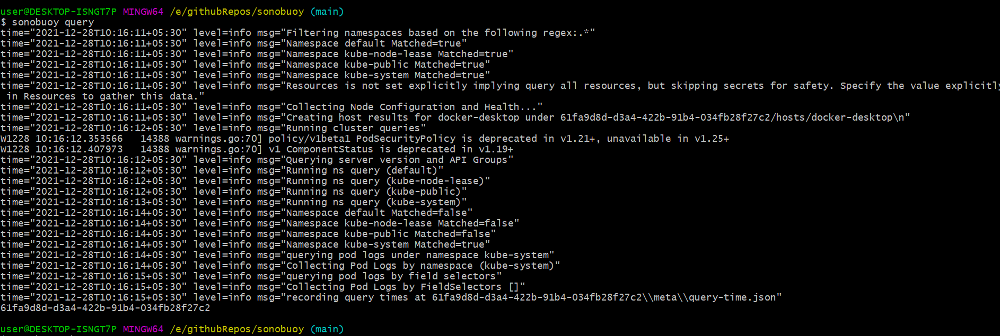
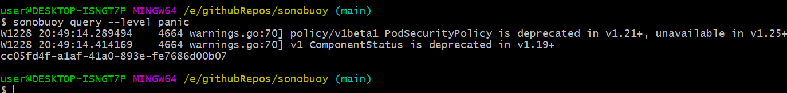

# `sonobuoy query` command

## Intro

`sonobuoy query` command runs queries against your cluster and helps in debugging by providing useful information about the cluster which helps us to find bugs and fix them before they can cause any severe harm to the cluster. These queries were run from the aggregator pod (made through `sonobuoy run`) in the past. Now you can run them locally without running Sonobuoy or launching pods. Just run sonobuoy query which is much faster and convenient.

- The logs are generated via logrus (https://github.com/sirupsen/logrus), which contains three parts
  `time, level, msg`.

- `msg` provides information about the cluster which helps us to find bugs in our clusters and tackle them.

- `level` specifies log level. We can specify it via the level flag and valid values are `{panic, fatal, error, warn, info, debug, trace}` and the default is `info`.

  

- By default, Sonobuoy uses creates a temporary directory in the current directory to store the query information. You can capture this directory for scripting (its the only value output to stdout) or you can specify your own directory via the `--output` flag.

- While logging we can also specify **sonobuoy config file** in order to specify query configuration values. This allows you to tweak things like which namespaces to get pod logs for or what API resources to query. In most cases, the default is appropriate (gets logs for kube-system and queries all non-secret resources).
